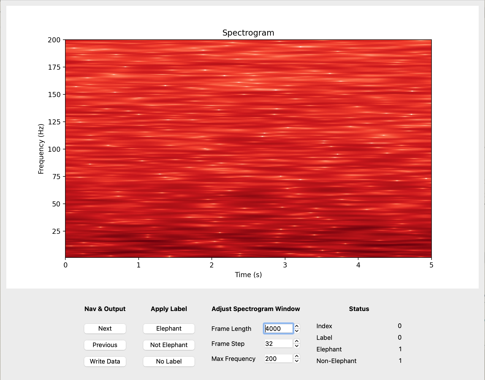

# Set Up

Run the following command to install the necessary packages. 

```
conda env create -f environment.yml -n new_env python=3.10
```

```
conda activate new_emv
```

# Usage
```
python main.py <input (.tfrecord)> <output (.tfrecord)> <output (.csv)>
```

Input a .tfrecord of Examples with a 'sample' key. They data should be tf.string
(serialized tensor) of 1 dimension (audio data) with a sampling frequency set to 4000 Hz.

Define an Output .tfrecord that the labeled data will be written to.

Define a .csv meta file that will store the state of each sample.

Example:
```
python main.py audio_test.tfrecord audio_test_cherrypick.tfrecord audio_test_cherrypick_meta.csv
```

# SigVu Overview
SigVu is a Python based signal exploration and labeling program for the niche
of exploring audio signals in TFRecord format.



This is the high-level UML for the archtecture of the project:

