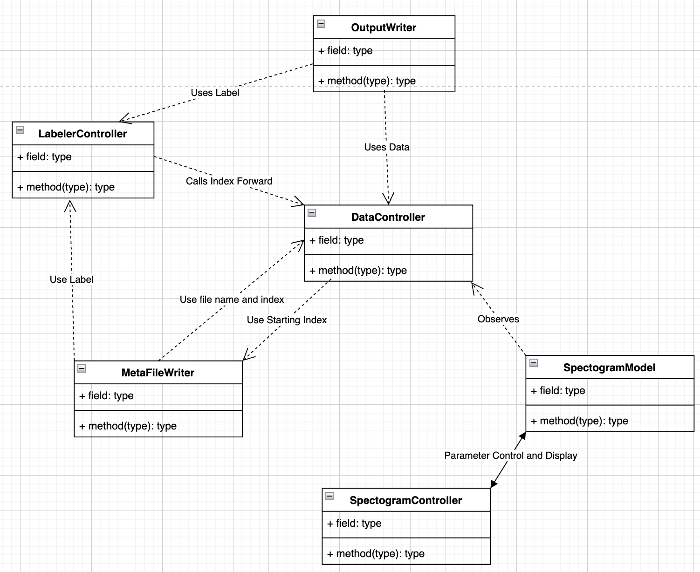

# SigVu
SigVu is a python based signal manipulation and labeling program.
I started developing this project when working on the Cornel & CSU, Chico 
Elephant Listening Project, when the need to relabel some of the samples was 
raised. 

This project utilizes standard ML, plotting, and data handling libraries
to process and label data, all bottled up in a simply PyQt5 GUI.

It serves a few purposes for me:
1. Interactive manipulation of data view signal processing functionality.
2. Real time view of the signal.
3. Simplified data labeling.
4. Python software engineering practice.

So far, this is the high-level UML for the archtecture of the project.

